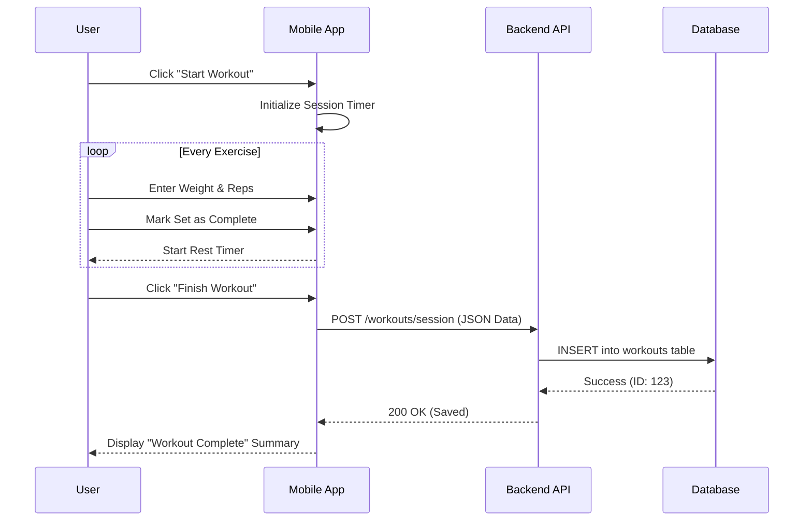
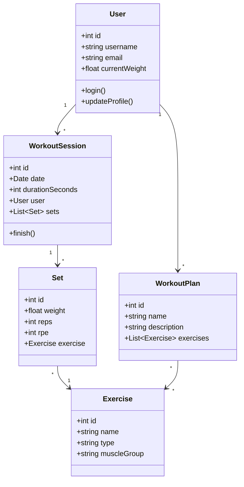

# System Models
**Project Name:** 3ASH - Gym & Progress Tracker
**Date:** February 8, 2026

## 1. Use Case Diagram
This diagram illustrates the interactions between the actors (User, System) and the use cases.

```mermaid
usecaseDiagram
    actor User
    actor Backend as "Backend System"

    User --> (Log In)
    User --> (Sign Up)
    User --> (Manage Profile)
    
    package "Workout Management" {
        User --> (View Workout Plan)
        User --> (Start Workout Session)
        User --> (Log Exercise Sets)
        User --> (Finish Workout)
        (Finish Workout) --> Backend : Save Data
    }

    package "Progress Tracking" {
        User --> (View Analysis)
        User --> (Update Body Metrics)
        (Update Body Metrics) --> Backend : Save Data
    }
```

---

## 2. Sequence Diagram (Log Workout)
This diagram details the sequence of events when a user logs a workout session.



---

## 3. Activity Diagram (Workout Flow)
This flowchart represents the user journey during a workout.

```mermaid
flowchart TD
    Start([Start]) --> Login{Logged In?}
    Login -- No --> SignUp[Sign Up / Login]
    Login -- Yes --> Dashboard[Home Dashboard]
    
    Dashboard --> SelectPlan[Select Workout Plan]
    SelectPlan --> StartSession[Start Session]
    
    StartSession --> LogSet[Log Set (Weight/Reps)]
    LogSet --> RestTimer[Rest Timer Countdown]
    RestTimer --> MoreSets{More Sets?}
    
    MoreSets -- Yes --> LogSet
    MoreSets -- No --> NextExercise{Next Exercise?}
    
    NextExercise -- Yes --> LogSet
    NextExercise -- No --> Finish[Finish Workout]
    
    Finish --> ViewSummary[View Summary Stats]
    ViewSummary --> End([End])
```

---

## 4. Class Diagram
This diagram models the data structure of the application.


